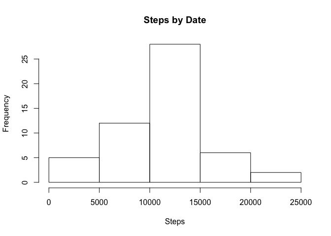
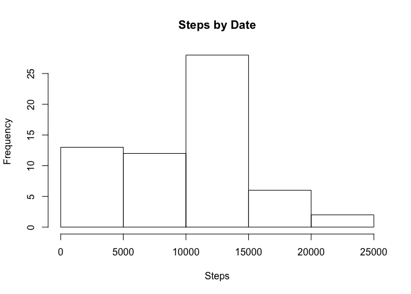
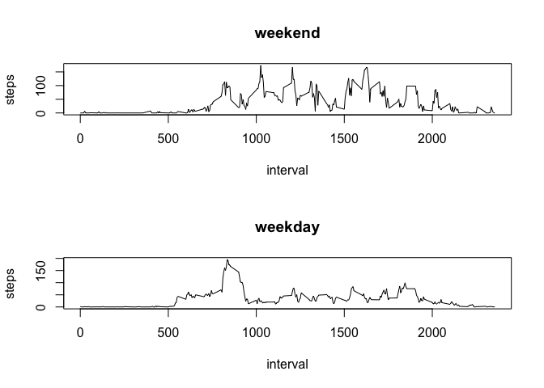

# Reproducible Research: Peer Assessment 1


## Loading and preprocessing the data

```r
data <- read.csv(unz("activity.zip", "activity.csv"))
steps_by_date <- aggregate(steps ~ date, data, sum)
```

## What is mean total number of steps taken per day?

```r
hist(steps_by_date$steps, xlab="Steps", main="Steps by Date")
```



```r
mean_steps_by_date <- mean(steps_by_date$steps)
median_steps_by_date <- median(steps_by_date$steps)
```
Mean steps taken per day are 1.0766189\times 10^{4}

Median steps taken per day are 10765

## What is the average daily activity pattern?


```r
avg_steps_by_interval <- aggregate(steps ~ interval, data, mean)
plot(avg_steps_by_interval, type='l')
```


```r
max_interval <- avg_steps_by_interval[which.max(avg_steps_by_interval$steps),]$interval
```

The time interval 835 contains the maximum number of steps

## Imputing missing values


```r
nmissing <- sum(is.na(data$steps))
library(plyr)
data_imputed <- ddply(data, 
      .(interval), 
      transform, 
      steps=ifelse(is.na(steps), median(steps, na.rm=TRUE), steps))
```

There are 2304 missing values in the dataset


```r
steps_by_date <- aggregate(steps ~ date, data_imputed, sum)
hist(steps_by_date$steps, xlab="Steps", main="Steps by Date")
```



```r
mean_steps_by_date <- mean(steps_by_date$steps)
median_steps_by_date <- median(steps_by_date$steps)
```

Mean steps taken per day are 9503.8688525
Median steps taken per day are 10395

## Are there differences in activity patterns between weekdays and weekends?


```r
dates <- as.Date(data_imputed$date)
data_imputed$isWeekday <- weekdays(dates) %in% 'Sunday'

data_weekend <- subset(data_imputed, isWeekday == T)
data_weekday <- subset(data_imputed, isWeekday == F)

weekend <- aggregate(steps ~ interval, data_weekend, mean)
weekday <- aggregate(steps ~ interval, data_weekday, mean)

par(mfrow=c(2,1))
plot(weekend, type='l', main='weekend')
plot(weekday, type='l', main='weekday')
```


